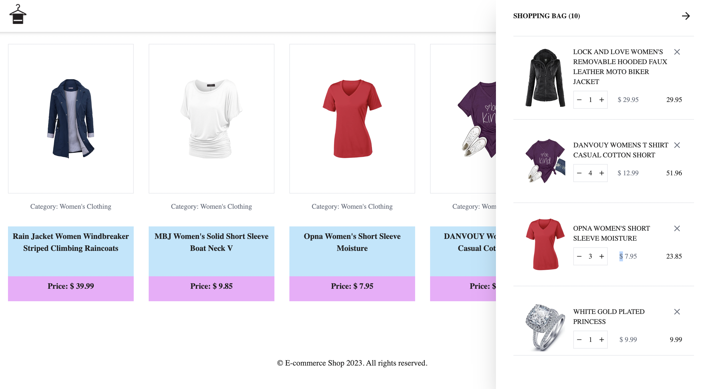
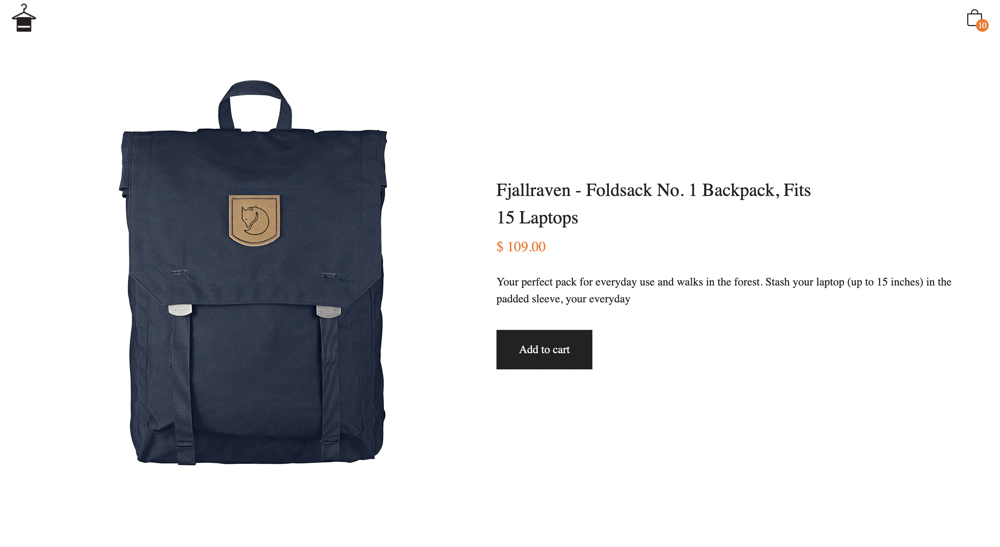

# 🚚 Online Shopping Cart

Add new items to the shopping cart, change the quantity or delete items. It also shows the total purchase amount and links to a separate product view.

<br>

<strong>[LIVE DEMO](https://get-shopping.netlify.app/)</strong>

<br>
<p align-right>



</p>

# Technology stack:
- React
- React useContext API
- React hooks
- Tailwind CSS
- Parcel
- Fully mobile responsive

## Link to API:
This project makes use of the Fakestore API for receiving the product data.
``` 
https://fakestoreapi.com/ 
```

## 🛠 Installation: 

<strong>Prerequisites</strong>

<br>

Run `npm i parcel -g` to install parcel globally.

```
git clone https://github.com/koola123/get-shopping.git
cd get-shopping
npm install
```
<br>

Run parcel on localhost:1234
```
parcel src/index.html
```

<br>

Version 1.0.0


